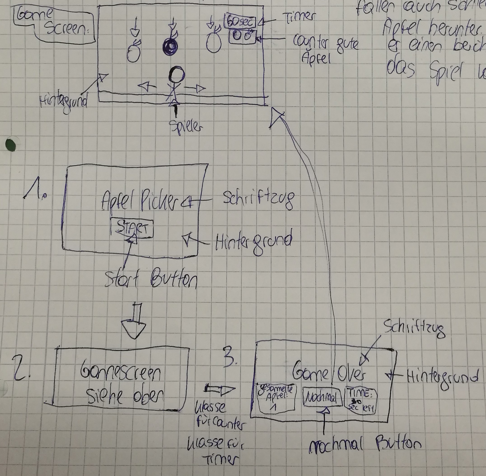

# Apple-Picker
Beschreibung des Spieles: 
Der Spieler muss mit den Pfeiltasten nach links und rechts gehen und hat 60 Sekunden Zeit um die guten, roten Äpfel einzusammeln, welche vom Himmel herunterfallen. Wenn er die schlechten, braunen Äpfel einsammelt ist das Spiel vorbei. Das Spiel ist ein 2D Browser Game.

Development Platform:
Windows 10
Unity Version: 2018.2.14.f1
Visual Studio Version: 2017 15.9.4

Target Platform: 
Web Browser

Steuerung: Pfeil Tasten (rechte & linke Pfeiltaste) und rechte Maustaste für die Menüauswahl

Ressourcen für dieses Spiel: 
Music: ToDo 
Sound: ToDo
Visuals: ToDo

Aktueller Stand: Spieleidee, Anfänge der Realisierung in Unity 

