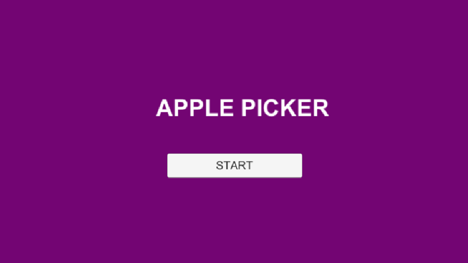
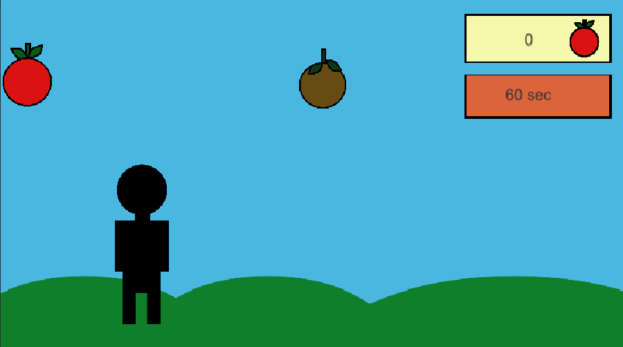
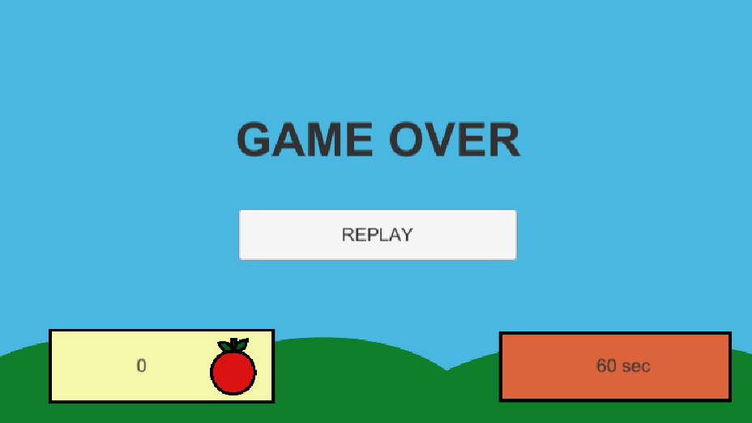

# Apple-Picker
**Beschreibung des Spieles:**
Der Spieler muss mit den Pfeiltasten nach links und rechts gehen und hat 60 Sekunden Zeit um die guten, roten Äpfel einzusammeln, welche vom Himmel herunterfallen. Wenn er die schlechten, braunen Äpfel einsammelt ist das Spiel vorbei. Das Spiel ist ein 2D Browser Game.

**Development Platform:**
* Windows 10
* Unity Version: 2018.2.14 f1
* Visual Studio Version: 2017 15.9.4
* Scripting Runtime Version: .NET 3.5 Equivalent
* Api Compatibility Level: .NET 2.0 Subset

**Target Platform:**
Web GL, reference resolution: 1920x1080

**Steuerung:**
Pfeil Tasten (rechte & linke Pfeiltaste) und rechte Maustaste für die Menüauswahl

**Ressourcen für dieses Spiel:** 

* Visuals: selbstgemacht, frei verwendbar für jede/n
* Player Script: angelehnt an Code von Ida Wagenhofer 
* Countdown Script: https://www.noob-programmer.com/unity3d/countdown-timer/
* Object Spawner Script: angelehnt an Code von Sarah Glavan

**Aktueller Stand:** Realisierung in Unity, 90% fertig 

**Game Screenshots:**

Home Screen

Gameplay

Game Over

**Lessons Learned:** Steuerung mit Pfeiltasten, richtiges Anlegen von 2D Szenen, Buttons anlegen, Time Counter programmieren, Spawnen von Objekten, C# Basics

**Limitations:** Der Score funktioniert nicht. Die vergangene Zeit sowie der Score wird am Endscreen nicht korrekt angezeigt. 

Copyright by Clea Eliasch